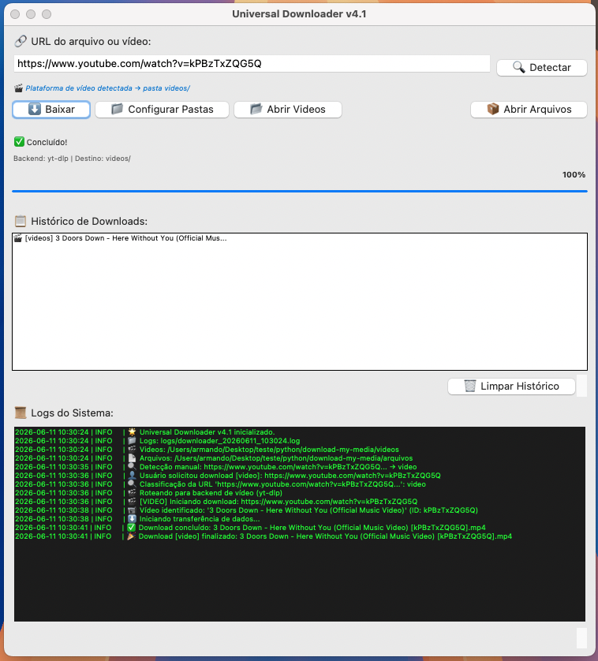

# Instruções

Aplicação de download de arquivos públicos da Internet

## Dependências

```bash
uv pip install yt-dlp requests
```

## Execução

```bash
uv run main.py
```

## Extra

Detalhes técnicos e descrição deste projeto disponível neste [link](projeto.md)

Para um projeto de download de arquivos públicos mais elaborado veja o projeto [Media-Downloader](https://github.com/mhogomchungu/media-downloader)


