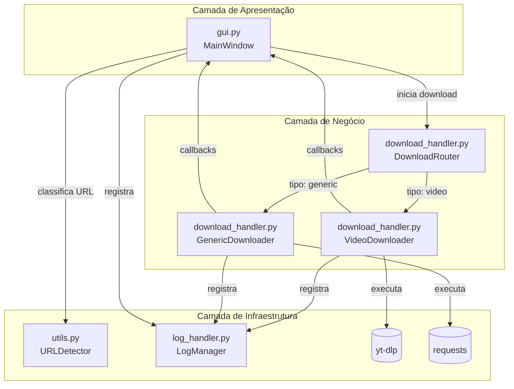

# 📚 Documentação Técnica de Software
## Universal Downloader v4.1

```
Projeto: Download My Medias
Versão: 4.1
Autor: Armando Soares Sousa
Data: Maio/2026
Licença: MIT
Status: ✅ Funcional | 🔄 Em evolução
```

## 📋 Sumário Executivo

| Seção | Descrição |
|-------|-----------|
| [1. Visão Geral](#1-visão-geral) | Propósito, escopo e público-alvo do software |
| [2. Arquitetura do Sistema](#2-arquitetura-do-sistema) | Diagramas, padrões de projeto e fluxo de dados |
| [3. Estrutura do Projeto](#3-estrutura-do-projeto) | Organização de arquivos e responsabilidades por módulo |
| [4. Stack Tecnológico](#4-stack-tecnológico) | Dependências, versões e justificativas técnicas |
| [5. Módulos e Componentes](#5-módulos-e-componentes) | Documentação detalhada de classes e funções |
| [6. Fluxo de Execução](#6-fluxo-de-execução) | Sequências de operação e diagramas de estado |
| [7. Configuração e Instalação](#7-configuração-e-instalação) | Guia passo a passo para setup do ambiente |
| [8. Guia de Uso](#8-guia-de-uso) | Instruções para o usuário final |
| [9. Tratamento de Erros](#9-tratamento-de-erros) | Matriz de exceções e estratégias de recuperação |
| [10. Sistema de Logs](#10-sistema-de-logs) | Estrutura, níveis e destinos de registro |
| [11. Testes e Qualidade](#11-testes-e-qualidade) | Estratégia de testes e métricas de cobertura |
| [12. Empacotamento e Distribuição](#12-empacotamento-e-distribuição) | Build, deploy e instalação em produção |
| [13. Roadmap e Melhorias](#13-roadmap-e-melhorias) | Plano de evolução técnica e funcional |
| [14. Apêndices](#14-apêndices) | Referências, glossário e troubleshooting |

## 1. Visão Geral

### 1.1 Propósito do Software

O **Universal Downloader v4.1** é uma aplicação desktop desenvolvida em Python com interface gráfica Tkinter, projetada para realizar downloads inteligentes de conteúdo multimídia da Internet. A aplicação detecta automaticamente o tipo de URL fornecida pelo usuário e roteia a operação para o backend apropriado:

```
┌─────────────────────────────────────┐
│  URL inserida pelo usuário          │
├─────────────────────────────────────┤
│  🔍 Classificação automática:       │
│  • Plataforma de vídeo → yt-dlp     │
│  • Arquivo genérico  → requests     │
│  • URL inválida      → Erro amigável│
└─────────────────────────────────────┘
```

### 1.2 Escopo Funcional

| Funcionalidade | Descrição | Prioridade |
|---------------|-----------|-----------|
| 🎥 Download de vídeos | Suporte a YouTube, Vimeo, TikTok, Twitch e outras plataformas via `yt-dlp` | Alta |
| 📄 Download de arquivos | Baixa arquivos públicos via HTTP/HTTPS usando `requests` | Alta |
| 🔗 Detecção inteligente | Classificação automática de URLs por padrão regex e heurística | Alta |
| 📊 Progresso em tempo real | Barra de progresso visual com atualização assíncrona | Alta |
| 📋 Histórico de sessões | Lista de downloads concluídos com metadados básicos | Média |
| 📜 Logging triplo | Registros simultâneos em arquivo, console e interface gráfica | Alta |
| 📁 Gestão de diretórios | Configuração independente de pastas para vídeos e arquivos | Média |
| 🧵 Interface responsiva | Execução em thread separada para evitar bloqueio da UI | Alta |

### 1.3 Público-Alvo

- **Usuários finais**: Pessoas que necessitam baixar vídeos ou arquivos para uso offline
- **Educadores**: Professores que coletam material audiovisual para aulas presenciais ou EAD
- **Pesquisadores**: Acadêmicos que arquivam conteúdo web para análise qualitativa
- **Desenvolvedores**: Estudantes e profissionais que utilizam o código como referência de arquitetura Python/Tkinter

### 1.4 Premissas e Limitações

| Premissa | Impacto |
|----------|---------|
| URLs de vídeo devem ser públicas ou acessíveis sem autenticação | Vídeos privados/assinatura não são suportados |
| Arquivos genéricos devem permitir download direto (sem redirect complexo) | Alguns sites com proteção anti-bot podem falhar |
| Conexão com a Internet estável e com banda adequada | Downloads grandes podem falhar em redes instáveis |
| Permissão de escrita nas pastas de destino padrão ou configuradas | Erro de permissão interrompe o download |


## 2. Arquitetura do Sistema

### 2.1 Diagrama de Componentes



### 2.2 Padrões de Projeto Aplicados

| Padrão | Implementação | Benefício |
|--------|--------------|-----------|
| **Facade** | `DownloadRouter` encapsula a lógica de roteamento entre backends | Interface simplificada para a UI; fácil adição de novos tipos de download |
| **Strategy** | `VideoDownloader` e `GenericDownloader` implementam estratégias distintas de download | Extensibilidade: novos backends podem ser adicionados sem modificar a UI |
| **Observer** | Callbacks `progress_cb`, `complete_cb`, `error_cb` notificam a UI sobre eventos | Desacoplamento entre lógica de download e atualização da interface |
| **Template Method** | Método `download()` define esqueleto do processo; subclasses implementam etapas específicas | Reuso de fluxo comum (validação, logging, tratamento de erro) |
| **Thread-Safe UI** | Uso de `root.after(0, ...)` para atualizações da interface a partir de threads | Previne `RuntimeError` do Tkinter e garante estabilidade |

### 2.3 Fluxo de Dados Principal

```
1. Usuário insere URL → gui.py:MainWindow.start_download()
2. Validação inicial → URLDetector.is_valid_http_url()
3. Classificação → URLDetector.classify_url() → ['video'|'generic'|'invalid']
4. Roteamento → DownloadRouter.download()
   ├─ Se 'video': VideoDownloader.download() → yt-dlp.YoutubeDL
   └─ Se 'generic': GenericDownloader.download() → requests.get()
5. Progresso → Callbacks → root.after() → atualização da UI
6. Conclusão/Erro → Callbacks → atualização de histórico/logs + feedback ao usuário
7. Logs → log_handler.py → arquivo + console + widget Text
```

---

## 3. Estrutura do Projeto

### 3.1 Árvore de Diretórios

```
download-my-medias/
├── 📄 main.py                 # Ponto de entrada: inicializa Tkinter e MainWindow
├── 📄 gui.py                  # Interface gráfica: classe MainWindow e widgets
├── 📄 download_handler.py     # Lógica de download: Router, VideoDownloader, GenericDownloader
├── 📄 utils.py                # Utilitários: URLDetector para classificação e parsing
├── 📄 log_handler.py          # Sistema de logs: handlers para arquivo/console/UI
├── 📄 pyproject.toml          # Metadados do projeto e dependências (uv/pip)
├── 📄 uv.lock                 # Lockfile de dependências (gerado pelo uv)
├── 📄 .gitignore              # Regras de exclusão para versionamento
├── 📄 .python-version         # Versão do Python recomendada (pyenv)
├── 📄 README.md               # Documentação de alto nível para usuários
├── 📁 logs/                   # [Gerado em runtime] Arquivos de log por sessão
├── 📁 videos/                 # [Gerado em runtime] Downloads de vídeo (yt-dlp)
├── 📁 arquivos/               # [Gerado em runtime] Downloads genéricos (requests)
```

### 3.2 Responsabilidades por Módulo

| Arquivo | Classe/Função Principal | Responsabilidade |
|---------|------------------------|-----------------|
| `main.py` | `main()` | Inicializa aplicação, configura ícone, centraliza janela, executa `mainloop()` |
| `gui.py` | `MainWindow` | Gerencia UI Tkinter, eventos de usuário, callbacks de progresso, histórico visual |
| `download_handler.py` | `DownloadRouter`, `VideoDownloader`, `GenericDownloader` | Orquestra downloads, integra com yt-dlp/requests, gerencia callbacks |
| `utils.py` | `URLDetector` | Classifica URLs, extrai nomes de arquivo, valida protocolos |
| `log_handler.py` | `setup_logging()`, `TkinterLogHandler` | Configura logging multiplo, formatação, rotação e exibição na UI |

---

## 4. Stack Tecnológico

### 4.1 Dependências Principais

```toml
# pyproject.toml (sugestão corrigida)
[project]
name = "download-my-medias"
version = "0.1.0"
description = "Aplicação desktop para download de vídeos e arquivos públicos da Internet"
readme = "README.md"
requires-python = ">=3.11"  # Compatibilidade ampliada
dependencies = [
    "requests>=2.32.0",     # HTTP client para downloads genéricos
    "yt-dlp>=2025.0.0",     # Backend estável para plataformas de vídeo
]

[project.scripts]
download-my-medias = "main:main"  # Entry point para execução via uv
```

### 4.2 Bibliotecas Padrão Utilizadas

| Módulo | Uso no Projeto |
|--------|---------------|
| `tkinter`, `ttk` | Interface gráfica nativa, widgets, layout, eventos |
| `threading` | Execução assíncrona de downloads para manter UI responsiva |
| `logging` | Sistema estruturado de registro de eventos com múltiplos handlers |
| `pathlib`, `os` | Manipulação segura de caminhos e diretórios multiplataforma |
| `urllib.parse`, `re` | Parsing de URLs, extração de componentes, padrões regex para detecção |
| `datetime` | Geração de timestamps para logs e nomes de arquivo únicos |
| `subprocess`, `platform` | Abertura de pastas no explorador de arquivos do sistema operacional |

### 4.3 Ferramentas de Desenvolvimento

| Ferramenta | Finalidade |
|-----------|-----------|
| `uv` | Gerenciador moderno de pacotes Python (substituto rápido para pip/poetry) |
| `pyenv` | Gerenciamento de múltiplas versões do Python (via `.python-version`) |
| `pytest` (sugerido) | Framework para testes automatizados unitários e de integração |
| `black`, `isort` (sugerido) | Formatação automática e organização de imports para consistência de código |

---

## 5. Módulos e Componentes

### 5.1 `utils.py` – URLDetector

```python
class URLDetector:
    """
    Classe utilitária para detecção, validação e parsing de URLs.
    
    Atributos de Classe:
        VIDEO_PLATFORMS (list[str]): Padrões regex para identificar plataformas de vídeo
    """
    
    @classmethod
    def is_valid_http_url(cls, url: str) -> bool:
        """
        Valida se a URL possui protocolo HTTP/HTTPS e domínio válido.
        
        Args:
            url (str): URL a ser validada
            
        Returns:
            bool: True se URL for válida, False caso contrário
        """
        try:
            parsed = urlparse(url)
            return parsed.scheme in ('http', 'https') and bool(parsed.netloc)
        except Exception:
            return False
    
    @classmethod
    def classify_url(cls, url: str) -> Literal['video', 'generic', 'invalid']:
        """
        Classifica o tipo da URL para roteamento no DownloadRouter.
        
        Args:
            url (str): URL a ser classificada
            
        Returns:
            str: 'video' | 'generic' | 'invalid'
        """
        if not cls.is_valid_http_url(url):
            return 'invalid'
        if cls.is_youtube_or_video_platform(url):
            return 'video'
        return 'generic'
    
    @classmethod
    def extract_filename_from_url(cls, url: str) -> tuple[str, str]:
        """
        Extrai nome base e extensão do arquivo a partir da URL.
        
        Args:
            url (str): URL contendo o recurso
            
        Returns:
            tuple[str, str]: (nome_base, extensão_com_ponto)
            
        Exemplo:
            >>> extract_filename_from_url("https://exemplo.com/docs/relatorio.pdf")
            ('relatorio', '.pdf')
        """
```

### 5.2 `download_handler.py` – DownloadRouter

```python
class DownloadRouter:
    """
    Facade que roteia URLs para o backend de download apropriado.
    
    Padrão: Facade + Strategy
    """
    
    def __init__(self, video_dir: str = "videos", generic_dir: str = "arquivos"):
        """
        Inicializa os backends de download com seus diretórios de saída.
        
        Args:
            video_dir (str): Pasta para salvar vídeos (yt-dlp)
            generic_dir (str): Pasta para salvar arquivos genéricos (requests)
        """
        self.video_downloader = VideoDownloader(output_dir=video_dir)
        self.generic_downloader = GenericDownloader(output_dir=generic_dir)
        self.logger = logging.getLogger("UniversalDownloader.Router")
    
    def download(
        self, 
        url: str, 
        progress_cb: Callable[[int], None],
        complete_cb: Callable[[str, str, str], None],
        error_cb: Callable[[str], None]
    ) -> None:
        """
        Roteia a URL para o backend correto e executa o download.
        
        Args:
            url (str): URL do recurso a ser baixado
            progress_cb (callable): Callback(int) para atualização de progresso (0-100)
            complete_cb (callable): Callback(str, str, str) para conclusão: 
                                   (nome_arquivo, caminho_completo, tipo_download)
            error_cb (callable): Callback(str) para tratamento de erros
        """
```

### 5.3 `download_handler.py` – VideoDownloader

```python
class VideoDownloader:
    """
    Backend especializado em downloads de plataformas de vídeo via yt-dlp.
    
    Configurações padrão do yt-dlp (ydl_opts):
        • 'format': 'bestvideo+bestaudio/best' → Qualidade máxima com merge
        • 'merge_output_format': 'mp4' → Formato final unificado
        • 'retries': 15 → Tolerância a falhas de rede
        • 'socket_timeout': 30 → Timeout para requisições HTTP
        • 'user_agent': 'Mozilla/5.0...' → Evita bloqueio por bot detection
    """
    
    def download(self, url: str, progress_cb, complete_cb, error_cb) -> None:
        """
        Executa download de vídeo com callbacks para UI.
        
        Fluxo:
            1. Extrai metadados sem baixar (extract_info)
            2. Valida informações retornadas
            3. Inicia download com progress_hooks
            4. Notifica conclusão ou erro via callbacks
        """
```

### 5.4 `download_handler.py` – GenericDownloader

```python
class GenericDownloader:
    """
    Backend para downloads de arquivos públicos via HTTP/HTTPS usando requests.
    
    Características:
        • Streaming com chunk_size=8192 para eficiência de memória
        • Resolução automática de conflitos de nome (suffix _1, _2...)
        • Tratamento específico de exceções requests (Timeout, ConnectionError, etc.)
        • Logging granular de progresso a cada 10%
    """
    
    def download(self, url: str, progress_cb, complete_cb, error_cb) -> None:
        """
        Executa download de arquivo genérico com streaming e callbacks.
        
        Fluxo:
            1. Extrai nome do arquivo da URL (fallback para nome genérico)
            2. Resolve conflitos de nome no diretório de destino
            3. Inicia requisição GET com stream=True
            4. Itera sobre chunks, escreve em disco e notifica progresso
            5. Notifica conclusão ou erro via callbacks
        """
```

### 5.5 `log_handler.py` – Sistema de Logs

```python
class TkinterLogHandler(logging.Handler):
    """
    Handler personalizado para exibir logs em widget tk.Text.
    
    Thread-safety:
        • Widget é atualizado apenas na thread principal via root.after()
        • Estado do widget alterado para 'normal' durante escrita, 
          depois restaurado para 'disabled' (somente leitura)
    
    Performance:
        • Limpeza automática de linhas antigas quando excede max_lines (FIFO)
        • Formatação mínima para evitar overhead de renderização
    """

def setup_logging(text_widget: tk.Text = None) -> logging.Logger:
    """
    Configura logger com múltiplos destinos.
    
    Handlers configurados:
        1. FileHandler → logs/downloader_YYYYMMDD_HHMMSS.log (nível DEBUG)
        2. StreamHandler → sys.stdout (nível INFO)
        3. TkinterLogHandler → widget Text da UI (nível INFO, opcional)
    
    Formato padrão:
        '%(asctime)s | %(levelname)-8s | %(message)s'
        Ex: 2026-05-30 15:45:01 | INFO     | 🎬 Roteando para backend de vídeo
    """
```

### 5.6 `gui.py` – MainWindow

```python
class MainWindow:
    """
    Interface gráfica principal da aplicação.
    
    Componentes da UI:
        • Input: Entry para URL, botões Baixar/Detectar/Configurar
        • Progresso: ProgressBar, labels de status e porcentagem
        • Histórico: Listbox com downloads concluídos da sessão
        • Logs: Text widget com esquema terminal (preto/verde)
    
    Thread-safety:
        • Todas as atualizações de UI usam root.after(0, callback)
        • Flag is_downloading previne downloads concorrentes
        • Estados de botões/entries são sincronizados com fluxo de download
    """
```

---

## 6. Fluxo de Execução

### 6.1 Sequência de Inicialização

```mermaid
sequenceDiagram
    participant User
    participant main.py
    participant Tk
    participant gui.py:MainWindow
    participant log_handler.py
    
    User->>main.py: Executa python main.py
    main.py->>Tk: root = tk.Tk()
    main.py->>MainWindow: MainWindow(root)
    MainWindow->>MainWindow: _setup_ui()
    MainWindow->>setup_logging: setup_logging(text_widget=log_text)
    setup_logging-->>MainWindow: Logger configurado com 3 handlers
    MainWindow-->>main.py: UI pronta e logs inicializados
    main.py->>Tk: Centraliza janela + protocol WM_DELETE_WINDOW
    main.py->>Tk: root.mainloop()
    Tk-->>User: Aplicação exibida e responsiva
```

### 6.2 Sequência de Download (Caso Vídeo)

```mermaid
sequenceDiagram
    participant User
    participant gui.py:MainWindow
    participant threading
    participant download_handler.py:DownloadRouter
    participant download_handler.py:VideoDownloader
    participant yt-dlp
    participant FileSystem
    
    User->>MainWindow: Clica "Baixar" com URL do YouTube
    MainWindow->>URLDetector: classify_url(url)
    URLDetector-->>MainWindow: 'video'
    MainWindow->>MainWindow: Desabilita UI, inicia thread daemon
    threading->>MainWindow: _run_download(url) em thread separada
    MainWindow->>DownloadRouter: download(url, callbacks)
    DownloadRouter->>VideoDownloader: download(url, callbacks)
    VideoDownloader->>yt-dlp: YoutubeDL(ydl_opts)
    yt-dlp->>yt-dlp: extract_info(url, download=False)
    yt-dlp-->>VideoDownloader: Metadados: título, ID, duração, views
    VideoDownloader->>VideoDownloader: Log: "📹 Vídeo identificado: ..."
    VideoDownloader->>yt-dlp: download([url])
    loop Progresso do Download
        yt-dlp->>VideoDownloader: _progress_hook(d)
        VideoDownloader->>MainWindow: progress_cb(pct) via root.after
        MainWindow->>MainWindow: _update_progress(pct)
        MainWindow->>UI: Atualiza barra, label %, status
    end
    yt-dlp-->>VideoDownloader: Download concluído, arquivo salvo
    VideoDownloader->>MainWindow: complete_cb(nome, path, 'video')
    MainWindow->>MainWindow: _finish_download(...)
    MainWindow->>FileSystem: Adiciona entrada no histórico
    MainWindow->>UI: Exibe messagebox de sucesso
    MainWindow-->>User: Interface restaurada, pronta para novo download
```

### 6.3 Diagrama de Estados da Interface

```
[Estado: Idle]
   │
   ├─▶ URL vazia → Warning → [Idle]
   ├─▶ URL inválida → Error → [Idle]
   └─▶ URL válida + Clique "Baixar"
         │
         ▼
[Estado: Downloading]
   │  • Botões desabilitados
   │  • Progresso: 0% → 100%
   │  • Logs em tempo real
   │
   ├─▶ Progresso atualizado → [Downloading]
   ├─▶ Download concluído → _finish_download() → [Idle] + Sucesso
   └─▶ Erro detectado → _handle_error() → [Idle] + Erro
```

---

## 7. Configuração e Instalação

### 7.1 Pré-requisitos do Sistema

| Componente | Versão Mínima | Como Verificar |
|-----------|--------------|----------------|
| Python | 3.11 | `python --version` |
| pip | 23.0 | `pip --version` |
| uv (opcional) | 0.4+ | `uv --version` |
| ffmpeg (opcional) | 5.0+ | `ffmpeg -version` |

> **Nota sobre ffmpeg**: Necessário apenas para merge automático de áudio+vídeo em downloads do yt-dlp. Sem ffmpeg, o yt-dlp baixa streams separados ou fallback para formato único disponível.

### 7.2 Instalação com uv (Recomendado)

```bash
# 1. Instale o uv (gerenciador moderno de Python)
curl -LsSf https://astral.sh/uv/install.sh | sh
# Ou via pip:
pip install uv

# 2. Clone ou extraia o projeto
git clone https://github.com/seu-usuario/download-my-medias.git
cd download-my-medias

# 3. Crie ambiente virtual e instale dependências
uv sync
# Ou manualmente:
uv venv
source .venv/bin/activate  # Linux/macOS
# ou
.venv\Scripts\activate  # Windows
uv pip install -r pyproject.toml

# 4. Execute a aplicação
uv run python main.py
# Ou, após configurar entry point:
uv run download-my-medias
```

### 7.3 Instalação com pip (Alternativa)

```bash
# 1. Crie ambiente virtual (recomendado)
python -m venv venv
source venv/bin/activate  # Linux/macOS
# ou
venv\Scripts\activate  # Windows

# 2. Instale dependências
pip install requests>=2.32.0 yt-dlp>=2025.0.0

# 3. Execute
python main.py
```

### 7.4 Estrutura de Pastas Geradas em Runtime

```
download-my-medias/
├── logs/
│   └── downloader_20260530_154501.log  # Log da sessão atual
├── videos/
│   ├── Aula de Python [abc123].mp4
│   └── Palestra Conferência [xyz789].mp4
├── arquivos/
│   ├── relatorio.pdf
│   ├── foto_evento.jpg
│   └── dados_exportados.csv
└── (arquivos do projeto...)
```

---

## 8. Guia de Uso

### 8.1 Fluxo Básico do Usuário

```
1️⃣ Inicialização
   → Aplicação abre centralizada na tela
   → Painel de logs exibe: "🌟 Universal Downloader v4.1 inicializado"
   → Pastas videos/, arquivos/, logs/ são criadas se não existirem

2️⃣ Inserir URL
   → Cole URL no campo "🔗 URL do arquivo ou vídeo:"
   → Opcional: Clique em "🔍 Detectar" para preview do tipo sem baixar
   → Exemplo de URLs válidas:
      • https://www.youtube.com/watch?v=dQw4w9WgXcQ
      • https://vimeo.com/123456789
      • https://exemplo.com/documento.pdf

3️⃣ Iniciar Download
   → Clique em "⬇️ Baixar" ou pressione ENTER
   → Interface exibe:
      • Status: "🎬 Conectando à plataforma..." ou "📄 Conectando ao servidor..."
      • Backend: "yt-dlp" ou "requests"
      • Destino: "videos/" ou "arquivos/"
   → Barra de progresso e porcentagem atualizam em tempo real

4️⃣ Monitoramento
   → Logs em tempo real no painel inferior (esquema terminal)
   → Mensagens de progresso a cada 10% (nível DEBUG no arquivo de log)
   → Interface permanece responsiva para outras ações

5️⃣ Conclusão
   → Mensagem: "✅ Concluído!" + popup com caminho do arquivo
   → Título/nome adicionado ao histórico com ícone (🎬 ou 📄)
   → Controles reabilitados para novo download

6️⃣ Gestão
   → "📂 Abrir Videos" / "📦 Abrir Arquivos": abre pasta no explorador
   → "📁 Configurar Pastas": diálogo modal para alterar diretórios de destino
   → "🗑️ Limpar Histórico": limpa lista da sessão atual (não apaga arquivos)
```

### 8.2 Exemplos de URLs Suportadas

| Tipo | Exemplo de URL | Backend | Pasta de Destino |
|------|---------------|---------|-----------------|
| YouTube | `https://youtu.be/abc123` | yt-dlp | `videos/` |
| YouTube (long) | `https://www.youtube.com/watch?v=abc123&list=PL...` | yt-dlp | `videos/` |
| Vimeo | `https://vimeo.com/987654321` | yt-dlp | `videos/` |
| TikTok | `https://www.tiktok.com/@user/video/123456789` | yt-dlp | `videos/` |
| PDF direto | `https://exemplo.com/docs/relatorio.pdf` | requests | `arquivos/` |
| Imagem | `https://site.com/foto.jpg` | requests | `arquivos/` |
| ZIP | `https://github.com/user/repo/archive/main.zip` | requests | `arquivos/` |

### 8.3 Configuração Avançada

#### Alterar Pastas de Destino
```
1. Clique em "📁 Configurar Pastas"
2. Diálogo modal abre com campos para:
   • 🎬 Pasta de Vídeos: [videos/] [Alterar...]
   • 📄 Pasta de Arquivos: [arquivos/] [Alterar...]
3. Clique em "Alterar..." para navegar até nova pasta
4. Clique em "💾 Salvar Configurações" para aplicar
```

#### Acessar Logs Detalhados
```
• Arquivo de log: logs/downloader_YYYYMMDD_HHMMSS.log
• Níveis registrados: DEBUG (arquivo), INFO (console + UI)
• Formato: timestamp | nível | mensagem
• Exemplo de busca no log:
  grep "Progresso" logs/downloader_*.log  # Linux/macOS
  findstr "Progresso" logs\downloader_*.log  # Windows CMD
```

---

## 9. Tratamento de Erros

### 9.1 Matriz de Exceções por Backend

#### VideoDownloader (yt-dlp)

| Exceção | Causa Provável | Mensagem ao Usuário | Ação do Sistema |
|---------|---------------|-------------------|----------------|
| `DownloadError: HTTP Error 400` | Vídeo privado, restrito por região, bloqueio por bot | "Vídeo indisponível ou restrito" | Log warning, restaura UI |
| `DownloadError: HTTP Error 403` | Token expirado, autenticação necessária | "Acesso negado. Verifique a URL" | Log error, restaura UI |
| `DownloadError: Unable to extract` | YouTube mudou estrutura da página | "Formato não suportado. Atualize o yt-dlp" | Log error + exception traceback |
| `FFmpegNotFoundError` | Merge requer ffmpeg ausente | "Instale ffmpeg para baixar em MP4" | Fallback para stream único se possível |
| `Socket timeout` | Conexão instável ou firewall | "Erro de conexão. Tente novamente" | Retry automático (15 tentativas) |

#### GenericDownloader (requests)

| Exceção | Causa Provável | Mensagem ao Usuário | Ação do Sistema |
|---------|---------------|-------------------|----------------|
| `MissingSchema` | URL sem http:// ou https:// | "URL inválida. Use http:// ou https://" | Log error, restaura UI |
| `ConnectionError` | DNS falhou, servidor offline | "Erro de conexão. Verifique sua internet" | Log error, restaura UI |
| `Timeout` | Servidor não respondeu em 30s | "Timeout na conexão. Tente novamente" | Log error, restaura UI |
| `HTTPError 404` | Arquivo não encontrado | "Arquivo não encontrado no servidor" | Log error, restaura UI |
| `HTTPError 403` | Acesso proibido ao recurso | "Acesso negado ao arquivo" | Log error, restaura UI |
| `PermissionError` | Sem permissão de escrita na pasta | "Verifique permissões da pasta de destino" | Log error, restaura UI |

### 9.2 Estratégia de Recuperação

```python
# Padrão implementado em ambos os backends:
try:
    # Lógica principal de download
    ...
except ExceptionSpecific as e:
    # Tratamento contextualizado
    logger.error(f"❌ Erro específico: {e}")
    error_cb(mensagem_amigavel(e))
except Exception as e:
    # Fallback para erros não previstos
    logger.exception(f"💥 Falha crítica: {type(e).__name__}")
    error_cb(f"Erro inesperado: {type(e).__name__}")
finally:
    # Garantia de restauração do estado da UI
    logger.debug("🏁 Thread finalizada")
    # UI restoration handled via callbacks + root.after()
```

### 9.3 Boas Práticas de Resiliência

- ✅ **Retry automático**: yt-dlp com `retries=15` para falhas transitórias de rede
- ✅ **Timeout configurável**: `socket_timeout=30` para evitar bloqueio infinito
- ✅ **Thread-safety**: Atualizações de UI sempre via `root.after(0, ...)`
- ✅ **Fallback gracioso**: Erros não crasham a aplicação, apenas notificam o usuário
- ✅ **Logging forense**: `logger.exception()` captura stack trace completo para debugging

---

## 10. Sistema de Logs

### 10.1 Arquitetura de Handlers

```
Logger "UniversalDownloader" (nível raiz: DEBUG)
│
├── FileHandler → logs/downloader_YYYYMMDD_HHMMSS.log
│   ├── Nível: DEBUG
│   ├── Encoding: utf-8
│   ├── Formato: '%(asctime)s | %(levelname)-8s | %(message)s'
│   └── Rotação: Manual (novo arquivo por sessão)
│
├── StreamHandler → sys.stdout (console/terminal)
│   ├── Nível: INFO
│   ├── Mesmo formato do FileHandler
│   └── Ideal para desenvolvimento e monitoramento rápido
│
└── TkinterLogHandler → widget Text da UI
    ├── Nível: INFO
    ├── Formato idêntico para consistência
    ├── Atualização via root.after() para thread-safety
    ├── Limpeza FIFO ao exceder 2000 linhas
    └── Esquema visual: fundo #1e1e1e, texto #00ff00, fonte Consolas 9pt
```

### 10.2 Níveis de Log e Uso Recomendado

| Nível | Quando Usar | Exemplo no Código |
|-------|------------|------------------|
| `DEBUG` | Detalhes técnicos, progresso granular, decisões internas | `logger.debug(f"Progresso: {pct}% ({downloaded:,}/{total:,} bytes)")` |
| `INFO` | Eventos normais do fluxo, ações do usuário, conclusões | `logger.info("👤 Usuário solicitou download: {url}")` |
| `WARNING` | Situações recuperáveis, fallbacks ativados, configurações subótimas | `logger.warning("⚠️ HTTP 400 detectado. Vídeo pode estar restrito")` |
| `ERROR` | Falhas que interrompem operação específica, mas não a aplicação | `logger.error(f"❌ Erro de download: {err_msg}")` |
| `CRITICAL` | Erros fatais do sistema que impedem continuidade | `logger.critical("💥 Falha crítica não tratada")` |

### 10.3 Exemplo de Saída de Log

```log
2026-05-30 15:45:01 | INFO     | 🌟 Universal Downloader v4.1 inicializado.
2026-05-30 15:45:01 | INFO     | 📁 Logs: /projeto/logs/downloader_20260530_154501.log
2026-05-30 15:45:01 | INFO     | 🎬 Videos: /projeto/videos
2026-05-30 15:45:01 | INFO     | 📄 Arquivos: /projeto/arquivos
2026-05-30 15:47:10 | INFO     | 👤 Usuário solicitou download [video]: https://youtube.com/watch?v=abc123
2026-05-30 15:47:10 | INFO     | 🔍 Classificação da URL 'https://youtube.com...': video
2026-05-30 15:47:10 | INFO     | 🎬 Roteando para backend de vídeo (yt-dlp)
2026-05-30 15:47:11 | DEBUG    | 🔍 Extraindo metadados do vídeo...
2026-05-30 15:47:13 | INFO     | 📹 Vídeo identificado: 'Aula Python Avançado' (ID: abc123)
2026-05-30 15:47:13 | DEBUG    | 📦 Duração: 3450s | Views: 125000
2026-05-30 15:47:13 | INFO     | ⬇️ Iniciando transferência de dados...
2026-05-30 15:47:20 | DEBUG    | 📊 [VIDEO] Progresso: 10% (2.6MB/26MB)
2026-05-30 15:47:27 | DEBUG    | 📊 [VIDEO] Progresso: 20% (5.2MB/26MB)
...
2026-05-30 15:49:45 | DEBUG    | 📊 [VIDEO] Progresso: 100% (26MB/26MB)
2026-05-30 15:49:46 | INFO     | ✅ Download concluído: Aula Python Avançado [abc123].mp4
2026-05-30 15:49:46 | DEBUG    | 🏁 Thread de download de vídeo finalizada.
2026-05-30 15:49:46 | INFO     | 🎉 Download [video] finalizado: Aula Python Avançado [abc123].mp4
```

### 10.4 Personalização do Logging

```python
# Para aumentar verbosidade no console (desenvolvimento):
# Em log_handler.py, setup_logging():
sh.setLevel(logging.DEBUG)  # Alterar de INFO para DEBUG

# Para desativar logs na UI (produção com foco em performance):
self.sys_logger = setup_logging(text_widget=None)

# Para rotação automática de logs (evitar arquivos muito grandes):
from logging.handlers import RotatingFileHandler
fh = RotatingFileHandler(
    LOG_FILE, 
    maxBytes=10*1024*1024,  # 10 MB por arquivo
    backupCount=5,          # Manter últimos 5 arquivos
    encoding='utf-8'
)
```

---

## 11. Testes e Qualidade (TO DO)

### 11.1 Estratégia de Testes Sugerida

```
tests/
├── __init__.py
├── conftest.py                 # Fixtures compartilhadas
├── test_utils.py              # Testes para URLDetector
│   ├── test_is_valid_http_url()
│   ├── test_classify_url_video_platforms()
│   ├── test_classify_url_generic()
│   ├── test_extract_filename_from_url()
│   └── test_edge_cases()
├── test_download_handler.py   # Testes de integração para backends
│   ├── test_video_downloader_mock_ytdlp()
│   ├── test_generic_downloader_mock_requests()
│   ├── test_download_router_classification()
│   └── test_callback_invocation()
├── test_gui.py                # Testes de interface (pytest-tkinter)
│   ├── test_main_window_initialization()
│   ├── test_download_button_state()
│   └── test_progress_update_thread_safety()
└── test_logging.py           # Validação de handlers e formatação
    ├── test_tkinter_log_handler_emit()
    ├── test_setup_logging_multi_destination()
    └── test_log_file_creation()
```

### 11.2 Exemplo de Teste Unitário (URLDetector)

```python
# tests/test_utils.py
import pytest
from utils import URLDetector

class TestURLDetector:
    
    def test_is_valid_http_url_true(self):
        assert URLDetector.is_valid_http_url("https://exemplo.com/arquivo.pdf") is True
        assert URLDetector.is_valid_http_url("http://site.org/foto.jpg") is True
    
    def test_is_valid_http_url_false(self):
        assert URLDetector.is_valid_http_url("not-a-url") is False
        assert URLDetector.is_valid_http_url("ftp://exemplo.com/file") is False
        assert URLDetector.is_valid_http_url("") is False
    
    def test_classify_url_youtube(self):
        urls = [
            "https://www.youtube.com/watch?v=abc123",
            "https://youtu.be/xyz789",
            "https://m.youtube.com/watch?v=test"
        ]
        for url in urls:
            assert URLDetector.classify_url(url) == 'video'
    
    def test_classify_url_generic(self):
        urls = [
            "https://exemplo.com/documento.pdf",
            "https://site.org/foto.jpg",
            "https://github.com/user/repo/archive/main.zip"
        ]
        for url in urls:
            assert URLDetector.classify_url(url) == 'generic'
    
    def test_extract_filename_from_url(self):
        name, ext = URLDetector.extract_filename_from_url(
            "https://exemplo.com/docs/relatorio_final.pdf"
        )
        assert name == "relatorio_final"
        assert ext == ".pdf"
    
    def test_extract_filename_fallback(self):
        name, ext = URLDetector.extract_filename_from_url(
            "https://exemplo.com/download"  # Sem nome no path
        )
        assert name.startswith("arquivo_")
        assert ext == ".bin"
```

### 11.3 Execução de Testes

```bash
# Instale dependências de teste (sugestão para pyproject.toml)
[project.optional-dependencies]
dev = [
    "pytest>=8.0.0",
    "pytest-cov>=4.1.0",
    "pytest-tkinter>=1.0.0"
]

# Execute testes
uv run pytest -v                    # Todos os testes com verbosidade
uv run pytest tests/test_utils.py  # Apenas testes de utils
uv run pytest --cov=. --cov-report=html  # Relatório de cobertura em HTML
```

### 11.4 Métricas de Qualidade Sugeridas

| Métrica | Meta | Ferramenta |
|---------|------|-----------|
| Cobertura de código | ≥ 80% | `pytest-cov` |
| Complexidade ciclomática | ≤ 10 por função | `radon`, `mccabe` |
| Conformidade PEP 8 | 100% | `flake8`, `pylint` |
| Type hints | ≥ 90% das funções | `mypy` |
| Tempo de resposta da UI | < 100ms para eventos | Profiling manual |

---

## 12. Empacotamento e Distribuição

### 12.1 Configuração do pyproject.toml (Corrigida)

```toml
[build-system]
requires = ["hatchling"]
build-backend = "hatchling.build"

[project]
name = "download-my-medias"
version = "0.1.0"
description = "Aplicação desktop para download de vídeos e arquivos públicos da Internet"
readme = "README.md"
requires-python = ">=3.11"
license = {text = "MIT"}
authors = [
    {name = "Armando Soares Sousa", email = "armando@ufpi.edu.br"}
]
keywords = ["downloader", "youtube", "tkinter", "yt-dlp", "desktop"]
classifiers = [
    "Development Status :: 4 - Beta",
    "Environment :: X11 Applications :: GTK",
    "Intended Audience :: End Users/Desktop",
    "License :: OSI Approved :: MIT License",
    "Operating System :: OS Independent",
    "Programming Language :: Python :: 3",
    "Programming Language :: Python :: 3.11",
    "Programming Language :: Python :: 3.12",
    "Programming Language :: Python :: 3.13",
    "Topic :: Internet :: WWW/HTTP",
    "Topic :: Multimedia :: Video",
]
dependencies = [
    "requests>=2.32.0",
    "yt-dlp>=2025.0.0",
]

[project.optional-dependencies]
dev = [
    "pytest>=8.0.0",
    "pytest-cov>=4.1.0",
    "black>=24.0.0",
    "mypy>=1.8.0",
]

[project.scripts]
download-my-medias = "main:main"

[project.gui-scripts]
download-my-medias-gui = "main:main"

[tool.hatch.build.targets.wheel]
packages = ["."]

[tool.pytest.ini_options]
testpaths = ["tests"]
python_files = ["test_*.py"]
python_classes = ["Test*"]
python_functions = ["test_*"]
```

### 12.2 Build e Distribuição

#### Com uv (recomendado)
```bash
# Build do pacote
uv build

# Instalação local para teste
uv pip install dist/download_my_medias-0.1.0-py3-none-any.whl

# Publicação no PyPI (opcional)
uv publish  # Requer configuração de tokens no ~/.pypirc
```

#### Com PyInstaller (para executável standalone)
```bash
# Instale PyInstaller
pip install pyinstaller

# Crie executável para sua plataforma
pyinstaller --onefile --windowed --name "DownloadMyMedias" main.py

# Arquivo gerado: dist/DownloadMyMedias.exe (Windows) ou bin/DownloadMyMedias (Linux/macOS)

# Observação: Inclua ffmpeg no bundle se desejar suporte completo a merge de streams
```

### 12.3 Estrutura de Instalação em Produção

```
/opt/download-my-medias/          # Instalação sistema (Linux)
├── bin/
│   └── download-my-medias       # Script de entrada
├── lib/
│   └── python3.11/site-packages/ # Dependências isoladas
├── share/
│   ├── applications/
│   │   └── download-my-medias.desktop  # Ícone no menu (Linux)
│   └── icons/
│       └── download-my-medias.png      # Ícone da aplicação
├── logs/                        # Diretório de logs (permissões apropriadas)
├── videos/                      # Diretório padrão para vídeos
└── arquivos/                    # Diretório padrão para arquivos

# Usuário final:
~/.local/share/download-my-medias/  # Configurações por usuário
├── config.json                # Preferências salvas (pastas customizadas)
├── history.json              # Histórico persistente de downloads
└── logs/                     # Logs por sessão do usuário
```

---

## 13. Roadmap e Melhorias

### 13.1 Prioridade Alta (Próximas Versões)

| Feature | Descrição | Impacto | Estimativa |
|---------|-----------|---------|-----------|
| 🔘 Botão Cancelar | Interrompe download em andamento, limpa arquivo parcial | UX crítica para downloads grandes | 2-3 dias |
| 📁 Arquivos temporários | Usa `.part` durante download, renomeia só ao concluir | Previne arquivos corrompidos no disco | 1-2 dias |
| 🏷️ Content-Disposition | Prioriza nome do cabeçalho HTTP sobre nome da URL | Melhora nomes de arquivos genéricos | 1 dia |
| 🧪 Suite de testes mínima | Testes para URLDetector e callbacks básicos | Garante estabilidade em mudanças | 3-5 dias |
| 📦 Dependências no pyproject.toml | Declara requests e yt-dlp explicitamente | Facilita instalação em novos ambientes | < 1 dia |

### 13.2 Prioridade Média (Evolução)

| Feature | Descrição | Benefício |
|---------|-----------|-----------|
| 📋 Histórico persistente | Salva downloads em `history.json` para recuperação entre sessões | Usuário não perde histórico ao fechar app |
| 🎚️ Seleção de qualidade | Combobox para escolher resolução (yt-dlp) ou formato (genérico) | Controle fino sobre o que é baixado |
| 📥 Download de playlists | Iteração sobre múltiplos itens em URLs de playlist do yt-dlp | Produtividade para downloads em massa |
| 🔊 Extração de áudio | Opção "Apenas áudio" com conversão para MP3 via ffmpeg | Casos de uso para podcasts/aulas |
| 🌐 Suporte a autenticação | Configuração de cookies/headers para sites com login | Expande escopo para conteúdos restritos |

### 13.3 Prioridade Baixa (Polimento)

| Feature | Descrição | Valor Agregado |
|---------|-----------|---------------|
| 🎨 Tema visual moderno | Alternância entre tema claro/escuro, customização de cores | Experiência do usuário mais agradável |
| 🖼️ Ícone customizado | Ícone real da aplicação em vez de placeholder | Profissionalismo e identidade visual |
| 📦 Instaladores nativos | .exe (Windows), .dmg (macOS), .deb/.rpm (Linux) | Facilidade de instalação para usuários não-técnicos |
| ℹ️ Tela "Sobre" | Diálogo com versão, licença, links para documentação | Transparência e suporte ao usuário |
| 🔄 Atualização automática | Verificação de nova versão e sugestão de update | Manutenção simplificada da base instalada |

### 13.4 Sugestão de Estrutura Futura do Projeto

```
download_my_medias/                 # Pacote Python instalável
├── __init__.py                    # Metadata do pacote
├── __main__.py                    # Entry point para python -m
├── main.py                        # Inicialização da aplicação
├── cli.py                         # Interface de linha de comando (opcional)
├── core/
│   ├── __init__.py
│   ├── router.py                  # DownloadRouter (lógica de roteamento)
│   ├── strategies/
│   │   ├── __init__.py
│   │   ├── base.py               # Abstract base class para estratégias
│   │   ├── video.py              # VideoDownloader (yt-dlp)
│   │   └── generic.py            # GenericDownloader (requests)
│   └── models.py                  # Data classes para URLInfo, DownloadResult
├── ui/
│   ├── __init__.py
│   ├── main_window.py            # MainWindow (interface Tkinter)
│   ├── widgets/                  # Componentes reutilizáveis
│   │   ├── progress_panel.py
│   │   ├── log_panel.py
│   │   └── history_list.py
│   └── themes.py                 # Configuração de estilos/temas
├── utils/
│   ├── __init__.py
│   ├── url_detector.py           # URLDetector (classificação e parsing)
│   ├── filesystem.py             # Utilitários para manipulação de arquivos
│   └── platform.py               # Helpers cross-platform (abrir pasta, etc.)
├── infrastructure/
│   ├── __init__.py
│   ├── logging_config.py         # setup_logging + handlers customizados
│   └── config_manager.py         # Carregamento/salvamento de preferências
├── tests/                        # Suite de testes (pytest)
├── docs/                         # Documentação adicional (Sphinx)
├── pyproject.toml
├── README.md
└── LICENSE
```

---

## 14. Apêndices

### 14.1 Glossário de Termos

| Termo | Definição |
|-------|-----------|
| **yt-dlp** | Fork ativo do youtube-dl, biblioteca Python para extração de vídeos de 1000+ sites |
| **Thread daemon** | Thread secundária que é automaticamente finalizada quando a thread principal encerra |
| **Callback** | Função passada como argumento para ser executada quando um evento ocorre |
| **root.after(0, ...)** | Método do Tkinter para agendar execução de código na thread principal (thread-safe) |
| **Content-Disposition** | Cabeçalho HTTP que sugere nome do arquivo para download (`attachment; filename="..."`) |
| **Facade Pattern** | Padrão de projeto que fornece interface simplificada para um subsistema complexo |
| **Strategy Pattern** | Padrão que permite trocar algoritmos/comportamentos em tempo de execução |

### 14.2 Troubleshooting Comum

| Sintoma | Causa Provável | Solução |
|---------|---------------|---------|
| Aplicação não abre | Dependências não instaladas | Execute `uv sync` ou `pip install -r pyproject.toml` |
| Download de vídeo falha com "HTTP 400" | YouTube bloqueou requisição ou vídeo é privado | Tente URL alternativa, verifique se vídeo é público, atualize yt-dlp |
| Arquivo genérico salva como "arquivo_XXXX.bin" | Servidor não envia Content-Disposition e URL não tem nome | Nome é gerado automaticamente; verifique URL ou use "Configurar Pastas" para organizar |
| Interface congela durante download | Thread não foi usada ou root.after() esquecido | Verifique se `_run_download` é executado em thread e atualizações de UI usam `root.after()` |
| Logs não aparecem no painel verde | Widget Text não foi passado para setup_logging() | Confirme chamada: `setup_logging(text_widget=self.log_text)` |
| Erro de permissão ao salvar arquivo | Pasta de destino sem permissão de escrita | Execute como administrador ou altere pasta via "Configurar Pastas" |
| ffmpeg não encontrado | Merge de streams falha sem ffmpeg | Instale ffmpeg ou altere formato em `ydl_opts['format']` para stream único |

### 14.3 Referências Técnicas

- **[yt-dlp Documentation](https://github.com/yt-dlp/yt-dlp)**: Opções, formatos suportados, hooks de progresso
- **[Tkinter Reference](https://docs.python.org/3/library/tkinter.html)**: Widgets, layout managers, eventos
- **[requests Documentation](https://requests.readthedocs.io/)**: Streaming, headers, tratamento de exceções
- **[Python Logging Cookbook](https://docs.python.org/3/howto/logging-cookbook.html)**: Handlers, formatters, melhores práticas
- **[PEP 8 – Style Guide](https://peps.python.org/pep-0008/)**: Convenções de código Python
- **[PEP 484 – Type Hints](https://peps.python.org/pep-0484/)**: Anotações de tipo para melhor manutenção

### 14.4 Contato e Contribuições

```
Autor: Armando Soares Sousa
E-mail: armando@ufpi.edu.br
Repositório: [inserir URL do Git, se aplicável]

Contribuições são bem-vindas!
Para reportar bugs ou sugerir melhorias:
1. Abra uma issue descrevendo o problema/sugestão
2. Inclua passos para reproduzir (se for bug)
3. Anexe logs relevantes (sem dados sensíveis)
4. Siga o código de conduta do projeto
```

---

> **Nota Final**: Esta documentação foi elaborada com foco em clareza técnica, extensibilidade e boas práticas de engenharia de software. O projeto Universal Downloader v4.1 representa uma base sólida para aplicações desktop Python com requisitos de download, logging e interface responsiva. Sinta-se à vontade para adaptar, expandir e utilizar como referência em contextos acadêmicos ou profissionais.

*Documento gerado em 30 de maio de 2026 | Versão 1.0 da documentação técnica* 🎓✨
